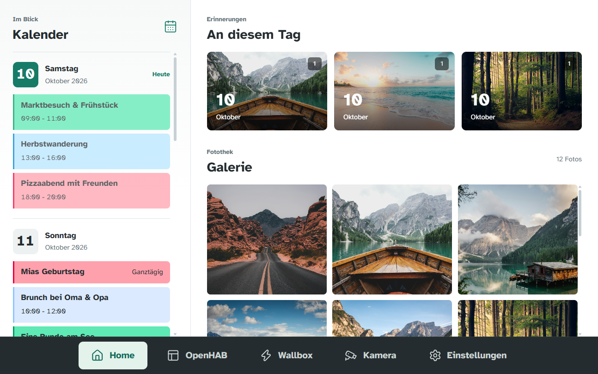
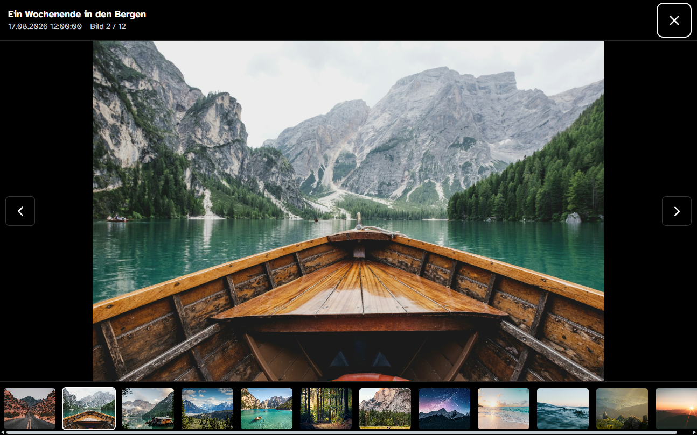

# Smart Home Dashboard

[](https://github.com/mheiss/dashboard/actions/workflows/build.yml)
[](https://github.com/mheiss/dashboard/releases)


A dashboard for your household calendars, photos, and smart-home controls.

Smart Home Dashboard brings Microsoft calendars and OneDrive photos together with openHAB, EVCC, and UniFi Protect. Designed for a wall-mounted tablet and just as useful in a browser, it gives the household a common view. A protected admin area handles account connections and source selection.



*Shard calendar on the left, a look back at this day in past years along with a gallery showing the latest photos on the right. Screenshots show the real app with fictional calendar entries and sample photography, not private household data. The current interface is in German.*

## At A Glance

| Everyday View | What It Brings Together |
| --- | --- |
| Calendar | A color-coded household agenda from selected Microsoft calendars. |
| Photos | OneDrive galleries, a look back at this day in past years, and a full-screen photo viewer. |
| Home controls | openHAB views, EVCC charging information, and UniFi Protect cameras through your existing integrations. |
| Account setup | Admin-only Microsoft account connection and calendar/photo source selection. |

The release ZIP includes the Quarkus backend and Angular interface. Microsoft synchronization and photo caching run on the server; smart-home integrations remain separate services. Deploy it on your household network behind an HTTPS reverse proxy, with Java 25 and PostgreSQL.

**[Download a release](https://github.com/mheiss/dashboard/releases)** | **[Linux setup](#linux-setup)** | **[Systemd service](#5-start-with-systemd)** | **[Development](#for-contributors)**

<details>
<summary><strong>A Closer Look: Photo Viewer</strong></summary>



Open a photo from the gallery to browse originals in the full-screen viewer. The filmstrip keeps the rest of the collection close at hand.

</details>

<details>
<summary>Demo Photography Credits</summary>

Sample photographs are from [Unsplash](https://unsplash.com/license). Original image sources used in these staged screenshots:

- [Desert road](https://images.unsplash.com/photo-1500530855697-b586d89ba3ee)
- [Boat on a mountain lake](https://images.unsplash.com/photo-1476514525535-07fb3b4ae5f1)
- [Lakeside cabin](https://images.unsplash.com/photo-1470770841072-f978cf4d019e)
- [Mountain panorama](https://images.unsplash.com/photo-1464822759023-fed622ff2c3b)
- [Turquoise lake](https://images.unsplash.com/photo-1501785888041-af3ef285b470)
- [Forest sunlight](https://images.unsplash.com/photo-1441974231531-c6227db76b6e)
- [Wildlife in the forest](https://images.unsplash.com/photo-1472396961693-142e6e269027)
- [Stars over the mountains](https://images.unsplash.com/photo-1519681393784-d120267933ba)
- [Beach at sunset](https://images.unsplash.com/photo-1507525428034-b723cf961d3e)
- [Ocean waves](https://images.unsplash.com/photo-1518837695005-2083093ee35b)
- [Mountain landscape](https://images.unsplash.com/photo-1469474968028-56623f02e42e)
- [Evening light](https://images.unsplash.com/photo-1500534623283-312aade485b7)

</details>

## Linux Setup

Run the downloaded release as a systemd service, with PostgreSQL and an HTTPS reverse proxy on the same machine. You need **Java 25**, **PostgreSQL**, **unzip**, **OpenSSL**, and **Caddy** (or an existing HTTPS proxy). No Gradle, Node.js, or frontend build is needed.

Install these using your distribution's packages or the official [Java](https://adoptium.net/temurin/releases/), [PostgreSQL](https://www.postgresql.org/download/), and [Caddy](https://caddyserver.com/docs/install) instructions. Check that `/usr/bin/java -version` reports Java 25; substitute its actual path in the service if needed.

This guide uses `https://dashboard.home.arpa`. Set up local DNS for that hostname and use it consistently in the proxy and Microsoft settings. **Keep the dashboard on your household network:** calendar and photo viewing are public to anyone who can reach it; only account setup requires the admin login.

### 1. Install The Release

Download the ZIP and `SHA256SUMS` from [GitHub Releases](https://github.com/mheiss/dashboard/releases). From the download directory, verify and extract them, replacing `0.0.1` with your version:

```bash
sha256sum --check SHA256SUMS
sudo install -d -m 0755 /opt/dashboard/releases/0.0.1
sudo unzip dashboard-0.0.1.zip -d /opt/dashboard/releases/0.0.1
sudo ln -s /opt/dashboard/releases/0.0.1 /opt/dashboard/latest
```

Stop if checksum verification fails. These are first-install commands; do not extract over an existing release. Keep the entire `quarkus-app/` directory together, readable by the service account but writable only by administrators.

| Location | Purpose |
| --- | --- |
| `/opt/dashboard/releases/<version>/` | Extracted application, including `quarkus-app/` and `examples/`. |
| `/opt/dashboard/latest` | Symlink to the active release directory. |
| `/etc/dashboard/` | Private `application.properties` and public `config.json`. |
| `/var/lib/dashboard/media/` | Persistent writable photo cache. PostgreSQL stores database data separately. |

### 2. Create The Database

For a new local database, open `sudo -u postgres psql` and run:

```text
CREATE ROLE dashboard LOGIN;
\password dashboard
CREATE DATABASE dashboard OWNER dashboard;
\connect dashboard
GRANT USAGE, CREATE ON SCHEMA public TO dashboard;
\q
```

Choose a database password at the prompt. If the role and database already exist, skip creating them. The schema grant is required for startup migrations; do not use a PostgreSQL superuser as the application's database account.

### 3. Register With Microsoft

In the [Microsoft Entra admin center](https://entra.microsoft.com/), create an app registration:

1. Choose an account type that includes **personal Microsoft accounts**.
2. Add the **Web** redirect URI `https://dashboard.home.arpa/accounts/callback` (not SPA).
3. Record the client ID and create a client secret; keep its **Value**, not its Secret ID.
4. Add Microsoft Graph **delegated** permissions: `User.Read`, `Calendars.Read`, and `Files.Read`. The app also requests `offline_access` for background refresh.

### 4. Configure The Dashboard

Create the service account and persistent directories. Skip `useradd` if the account already exists:

```bash
sudo useradd --system --user-group --home-dir /var/lib/dashboard --shell /usr/sbin/nologin dashboard
sudo install -d -o root -g dashboard -m 0750 /etc/dashboard
sudo install -d -o dashboard -g dashboard -m 0750 /var/lib/dashboard /var/lib/dashboard/media
```

For a **first installation only**, copy the samples and edit them. Do not overwrite existing configuration:

```bash
sudo install -o root -g dashboard -m 0640 /opt/dashboard/latest/examples/application.properties /etc/dashboard/application.properties
sudo install -o root -g dashboard -m 0640 /opt/dashboard/latest/examples/config.json /etc/dashboard/config.json
sudoedit /etc/dashboard/application.properties
sudoedit /etc/dashboard/config.json
```

In `application.properties`, replace every `REPLACE_...` placeholder with your database password, an admin password of at least 12 characters, Microsoft client ID/secret, and two independent encryption keys. For a first installation, generate each key in a private terminal with `openssl rand -base64 32`: one for `dashboard.token-key`, another for `quarkus.http.auth.session.encryption-key`. Save them securely and **reuse the original keys during upgrades**.

Change the sample's paths and hostname as needed:

```properties
dashboard.ui-config-file=/etc/dashboard/config.json
dashboard.media-directory=/var/lib/dashboard/media
dashboard.allowed-origins=https://dashboard.home.arpa
dashboard.microsoft.redirect-uri=https://dashboard.home.arpa/accounts/callback
```

Keep `quarkus.http.host=127.0.0.1` and the loopback proxy trust settings for this same-machine deployment. Leave `dashboard.microsoft.webhook-url` unset; scheduled synchronization needs no public webhook.

`config.json` holds the openHAB, EVCC, and camera settings, not Microsoft source selections. It is served publicly by `/config`; **never put credentials in it**. The properties file contains private secrets and must stay out of Git. Advanced runtime settings and environment overrides are covered in the backend reference: [server/README.md](server/README.md) on GitHub, or `BACKEND.md` in the release ZIP.

### 5. Start With Systemd

Create `/etc/systemd/system/dashboard.service`:

```ini
[Unit]
Description=Smart Home Dashboard
Wants=network-online.target
After=network-online.target

[Service]
Type=simple
User=dashboard
Group=dashboard
StateDirectory=dashboard
StateDirectoryMode=0750
WorkingDirectory=/var/lib/dashboard
ExecStart=/usr/bin/java -Dquarkus.config.locations=/etc/dashboard/application.properties -jar /opt/dashboard/latest/quarkus-app/quarkus-run.jar
Restart=on-failure
RestartSec=5
TimeoutStopSec=30
UMask=0027
NoNewPrivileges=true
PrivateTmp=true
ProtectSystem=strict
ProtectHome=true

[Install]
WantedBy=multi-user.target
```

The service explicitly reads `/etc/dashboard/application.properties`. `/var/lib/dashboard` is its working directory and writable state directory; binaries and configuration remain read-only. Logs go to journald. PostgreSQL must be running; network readiness alone does not guarantee database readiness.

```bash
sudo systemd-analyze verify /etc/systemd/system/dashboard.service
sudo systemctl daemon-reload
sudo systemctl enable --now dashboard
sudo journalctl -u dashboard -f
```

First startup migrates the database and creates the admin user. Check readiness with `curl --fail http://127.0.0.1:8080/q/health/ready`.

### 6. Set Up HTTPS And Connect Accounts

With Caddy installed as a service, add this site to `/etc/caddy/Caddyfile`:

```caddyfile
dashboard.home.arpa {
    tls internal
    reverse_proxy 127.0.0.1:8080
}
```

```bash
sudo caddy validate --config /etc/caddy/Caddyfile --adapter caddyfile
sudo systemctl enable --now caddy
sudo systemctl reload caddy
```

Install Caddy's root CA certificate in every client device's trust store. For the standard Linux Caddy service it is usually `/var/lib/caddy/.local/share/caddy/pki/authorities/local/root.crt`. Copy only the public certificate, never the CA's private key. An existing trusted HTTPS proxy can replace Caddy. Allow HTTPS on the LAN, keep port 8080 on loopback, and do not forward the dashboard to the internet.

Open `https://dashboard.home.arpa/home` without certificate warnings. Click settings, enter the local admin password, and connect each owner's Microsoft account. Select calendars and enable OneDrive folders such as `Pictures/Camera Roll` in `/setup`. Synchronization normally runs every five minutes. Use `/home` as the wall tablet's start URL.

<details>
<summary>Optional Smart-Home Integrations</summary>

openHAB, EVCC, and go2rtc run separately. Configure their URLs and camera IDs in `/etc/dashboard/config.json`. Embedded views must be reachable from the tablet over HTTPS and allow iframe embedding.

For openHAB and cameras, replace the site's simple proxy with this routing example, substituting your upstream addresses:

```caddyfile
dashboard.home.arpa {
    tls internal
    handle_path /api/openhab/* {
        rewrite * /rest{path}
        reverse_proxy openhab.example.lan:8080
    }
    handle_path /ws/openhab* {
        rewrite * /ws{path}
        reverse_proxy openhab.example.lan:8080
    }
    handle_path /api/webrtc* {
        rewrite * /api{path}
        reverse_proxy 127.0.0.1:1984 {
            header_up -Origin
        }
    }
    handle {
        reverse_proxy 127.0.0.1:8080
    }
}
```

Keep required openHAB authentication on the proxy; this example does not supply credentials. Configure [go2rtc](https://github.com/AlexxIT/go2rtc/) with streams named `unifi_<cameraId>` and `unifi_<cameraId>_medium`, matching `protect.cameras`. Validate the Caddyfile and reload the Caddy service after changes.

</details>

## Service Operations

```bash
sudo systemctl status dashboard
sudo journalctl -u dashboard -n 100 --no-pager
sudo systemctl restart dashboard
```

Restart after changing backend properties. After changing the unit, run `sudo systemctl daemon-reload` first. Public JSON edits need only a browser reload.

To upgrade, back up PostgreSQL and `/etc/dashboard` (including the original encryption keys), verify the new archive's checksum, and extract it into a **new** root-owned release directory. Stop the app before switching the existing `latest` symlink:

```bash
sudo systemctl stop dashboard
sudo ln -sfn /opt/dashboard/releases/0.0.2 /opt/dashboard/latest
sudo systemctl start dashboard
sudo journalctl -u dashboard -n 100 --no-pager
```

Configuration and media stay in place; do not copy samples over them. Keep the previous release until its process has stopped. Database migrations may require restoring a matching database backup to roll back. Renew expiring Microsoft client secrets in the properties file and restart; changing the bootstrap admin password does not reset an existing user's password.

## Troubleshooting

Start with `sudo journalctl -u dashboard -n 100 --no-pager`.

| Symptom | Check |
| --- | --- |
| Service fails to start | Java 25 path, `latest` symlink, file permissions, and unreplaced properties placeholders. |
| Database errors | PostgreSQL availability, credentials, and `USAGE, CREATE` privileges on the database's `public` schema. |
| HTTPS or proxy errors | Local DNS, trusted CA, Caddy logs, and backend readiness on `127.0.0.1:8080`. |
| `/config` returns 503 | `/etc/dashboard/config.json` exists, contains valid JSON, and is readable by `dashboard`. |
| Microsoft sign-in or requests fail | Redirect URI and allowed origin exactly match your HTTPS hostname; retain the original token key. |
| Calendar or gallery is empty | Connect accounts, select and enable sources, then allow time for synchronization. |

## For Contributors

The source repository contains `server/` (Quarkus) and `ui/` (Angular). Developer setup, formatting, tests, and builds are documented in [server/README.md](server/README.md) and [ui/README.md](ui/README.md). These source-directory links apply on GitHub, not in the extracted ZIP, which includes the backend reference as `BACKEND.md`.

Every push and pull request runs **Build** and produces a downloadable deployment artifact. Publishing a GitHub Release builds its tag and attaches the application ZIP and `SHA256SUMS`. You do not need these pipelines to use a downloaded release.
